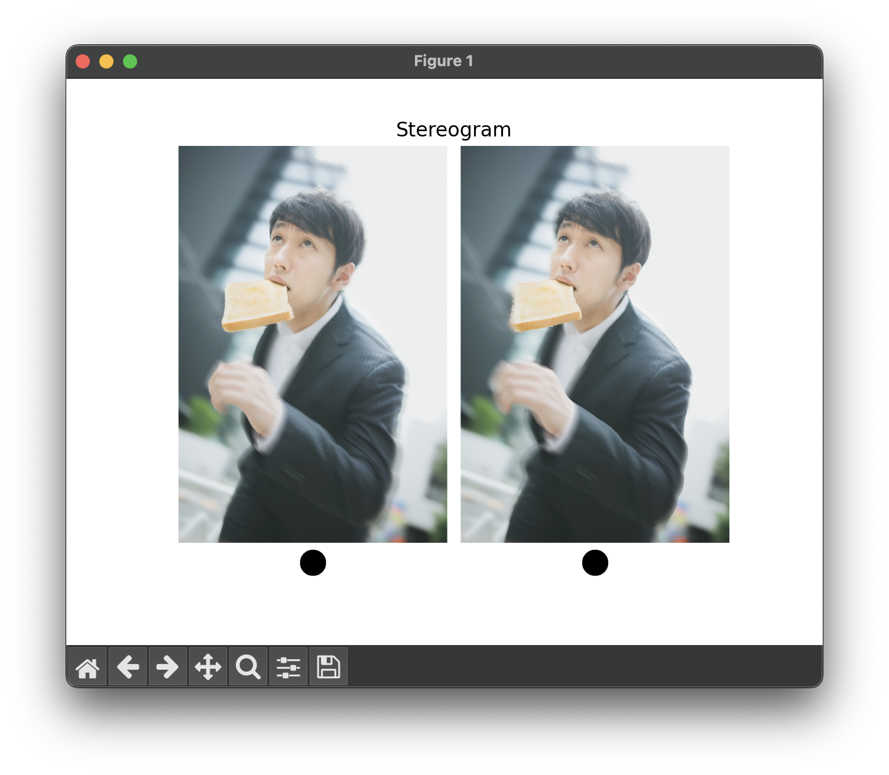
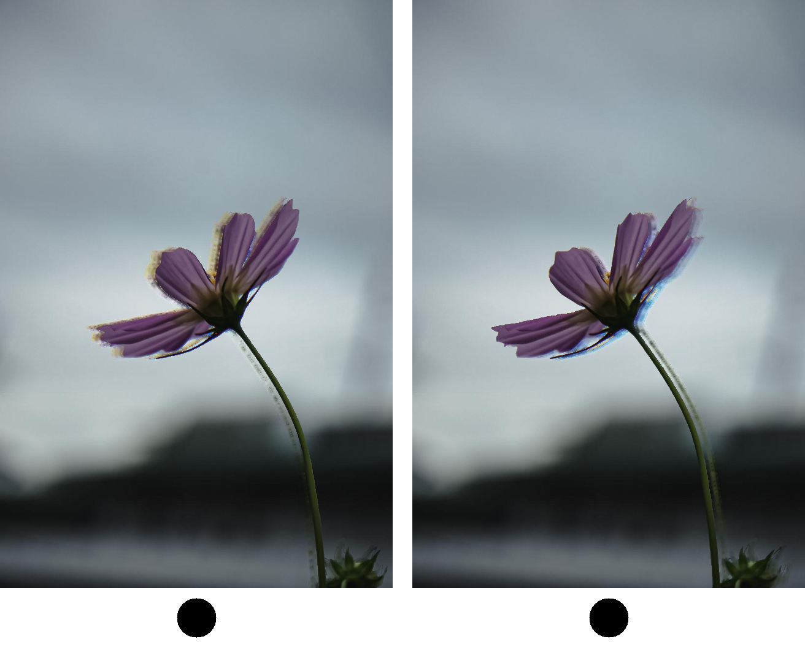

# Picture2Stereogram
一枚の写真から,平行法または交差法によって裸眼立体視できるステレオグラムを生成します.

## 開発環境
- device:MacBook Air M1
- os:macOS sonoma 14.6.1
- python:3.12.3
- use packages:
    - opencv-python=4.10.0
    - torch=2.4.0
    - torchvision=0.19.0
    - numpy=1.26.4
    - scikit-learn=1.5.1
    - matplotlib=3.9.1.post1
- [Depth-Anything-V2](https://github.com/DepthAnything/Depth-Anything-V2)

## 使用方法
Depth-Anythin-V2を使用するための準備の詳細は,[GitHub-Depth-Anything-V2](https://github.com/DepthAnything/Depth-Anything-V2)の案内を参照してください.ただし,Picture2Stereogramでは小さいモデル(vits)を使います.大きいモデルの実行確認はしていないので,必要に応じてソースコードを編集してください.
### 準備
```
git clone https://github.com/jukkyni/Picture2Stereogram
cd Picture2Stereogram
```
### modulesのステレオグラム生成器を使う場合
```python
import cv2
from modules.parallax import ParallaxGenerator
img = cv2.('input_filepath')
pg = ParallaxGenerator(img, max_parallax=15) # ステレオグラム生成器を作成
pg.generate() # ステレオグラム化の実行
```

### run.pyを使う場合
```
python run.py <inpath> \
  --outpath <outpath> --max_parallax <num> --downscale <num> \
  [--cross] [--pyplot] [--split]
```
#### 引数とオプション:
- `<inpath>`:3チャンネルカラー画像または1チャンネルモノクロ画像の,拡張子を含むファイル名.
- `--outpath`:ステレオグラムを保存するディレクトリ,またはファイル名(出力は.png形式に統一されます).
- `--max_parallax`:立体視するために必要な視差量の最大値.デフォルトでは15が指定されます.
- `--downscale`:入力画像はdownscaleで指定された比率にリサイズされてから処理されます.
- `--cross`:交差法に対応したステレオグラムを出力します.デフォルトでは平行法を用います.
- `--pyplot`:ステレオグラムをpyplotで表示します.
- `--split`:ステレオグラムの左右の画像を個別に保存します.`--outpath`が指定されていない場合は無視されます.
#### 使用例
`python run.py examples/demo1.jpg --pyplot --cross`  

`python run.py examples/demo2.jpg --downscale 0.8 --outpath examples --pyplot`

#### 注意
- `--outpath`でディレクトリを指定する場合は,`examples/`のように末尾に区切り文字を含めないでください.
- ステレオグラムを保存する場合は,出力ファイルは`.png`形式に統一されます.

## ステレオグラム化の詳細
### モジュールの説明
modulesのparallax.pyにあるParallaxGeneratorクラスは,指定された画像のステレオグラム化プロセスを管理します.ParallaxGeneratorインスタンスの関数generate()を実行すると,画像のステレオグラム化が実行されます.
### ステレオグラム化の仕組み
ステレオグラムは,裸眼立体視を可能にするための視差を含む画像です.視差はカメラ(または人間の目)に近いほど大きく,遠いほど小さくなります.Picture2Stereogramでは,次の手順で一枚の入力画像からヒストグラムの左目用・右目用の2枚の画像を生成します.
1. Depth-Anything_V2による単眼深度推定を行い,入力画像内の物体の距離を特定します.
1. 次に,ミーンシフト法によって距離ごとに物体をラベリングし,距離に応じた視差量だけ物体を左右に平行移動させます.
1. 最後に,物体を移動させたことによってできた画像の穴をopencvのinpaintによって修正します.

## LICENSE
Picture2Stereogramは,[Apache-2.0ライセンス](http://www.apache.org/licenses/LICENSE-2.0)に準じ,Picture2Stereogramの一部または全部の利用,改変,再配布などを許可します.  
また,Picture2Stereogramは,[Apache-2.0ライセンス](http://www.apache.org/licenses/LICENSE-2.0)で配布されている製作物を含みます.